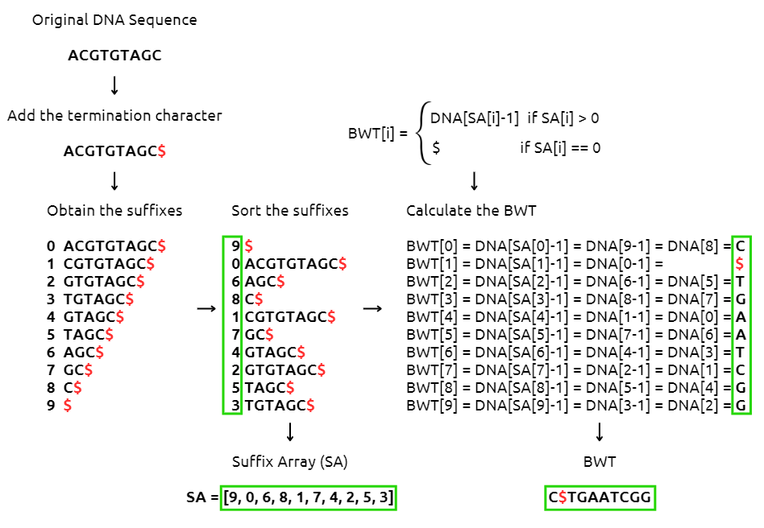

# BWT Server and Client
---

This project implements a **Server-Client network** that manages the conversions from a DNA sequence to its **Burrows-Wheeler Transform (BWT)** and viceversa.

BWT is a transformation used in bioinformatics to rearrange the characters in a string so that repeated sequences are grouped together, making it easier to compress.
It is used by tools such as `bwa` (Burrows-Wheeler Alignment), useful for converting a SAM file to a BAM file, aligned to its reference genome.

## Which functionalities does the project provide?
- **BW-Transformation from a DNA sequence to its BWT**: the client submits a DNA sequence to the server with the <code>/bwt</code> endpoint, which elaborates it and gives its BWT as answer
- **Inverse BW-Transformation from a BWT to its DNA sequence**: the client submits a BWT to the server with the <code>/inverse_bwt</code> endpoint, which elaborates it and gives its original DNA sequence as answer.

<figure>
    
    <figcaption>Suffix array method for the BWT calculation.</figcaption>
</figure>

## Which files are included?
```bash
BWTServerClient/
├── server.py
├── client.py
├── bwt_functionalities.py
├── configurator.cfg
├── example_dnasequence.fasta
├── README.md
└── BWTfunctioning.png
```

Besides this `README.md` file and the `.png` image representing the BWT process, these are the files you will need to make this project properly work:

- *server.py*: server in Flask, it provides two APIs to perform the BWT transformation and its inverse.

- *client.py*: client that submits requests to the server to perform the BWT transformation and its inverse.

- *bwt_functionalities.py*: script containing the functions needed to perform both the BWT transformation (which relies on the suffix array method) and its inverse. These functions are stored in a separate file from the client and server so that they can be edited conveniently, without having to make changes to the other files, and to better visualise the individual transformation steps.

- *configurator.cfg*: configuration file with the host and port specifications for the server. During the network execution, the client input command must contain the same values specified for the `host` and the `port` in this file.

## How to Set Up the Client and the Server?

### 1. Install Python and Python packages
- `Python` (development version: 3.11)

- `Flask` (development version: 3.1.0)

- `requests` (development version: 2.31.0)

- `configparser` (development version: 7.1.0)

- `argparse` (development version: 1.4.0)

### 2. Setup the Server
1. Modify the values for the `host` and the `port` in `configurator.cfg` (default: local host, predefined Flask port 5000).

2. Run `python server.py`.

From this moment on, the server is ready to receive and elaborate the requests submitted from the client.

### 3. Setup the Client
Specify the `host` (below in the examples as `<server_host>`, must be the same specified in the `configurator.cfg` file), `port` (below in the examples as `<server_port>`, must be the same specified in the `configurator.cfg` file), the action of interest (bwt or inverse_bwt) and the sequence. The latter can be provided both via command line or FASTA file (in this case, use the option `--fasta`).

**Examples:**
- *Run BWT providing the DNA sequence directly on the command line*

`python client.py --host <server_host> --port <server_port> --sequence "ACGTGTAGC"`

- *Run BWT providing a FASTA file containing the DNA sequence*

`python client.py --host <server_host> --port <server_port> --fasta "example_dnasequence.fasta"`

- *Run the inverse BWT providing the BWT sequence of the original DNA sequence of interest*

`python client.py --host <server_host> --port <server_port> --bwt "C$TGAATCGG"`

## References

Ben Langmead: ["Introduction to the Burrows-Wheeler Transform and FM Index".](https://www.cs.jhu.edu/~langmea/resources/bwt_fm.pdf)

Michael Burrows and David J Wheeler: ["A block-sorting lossless data compression algorithm".](https://www.cs.jhu.edu/~langmea/resources/burrows_wheeler.pdf)

Author of this project: Alessia Lorenzi
